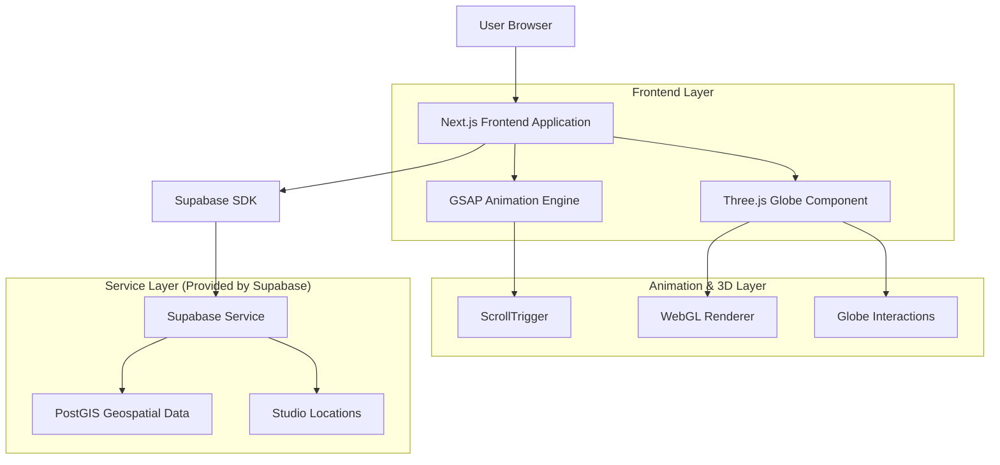
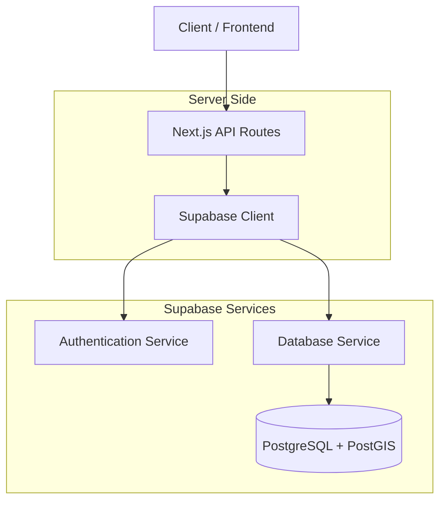
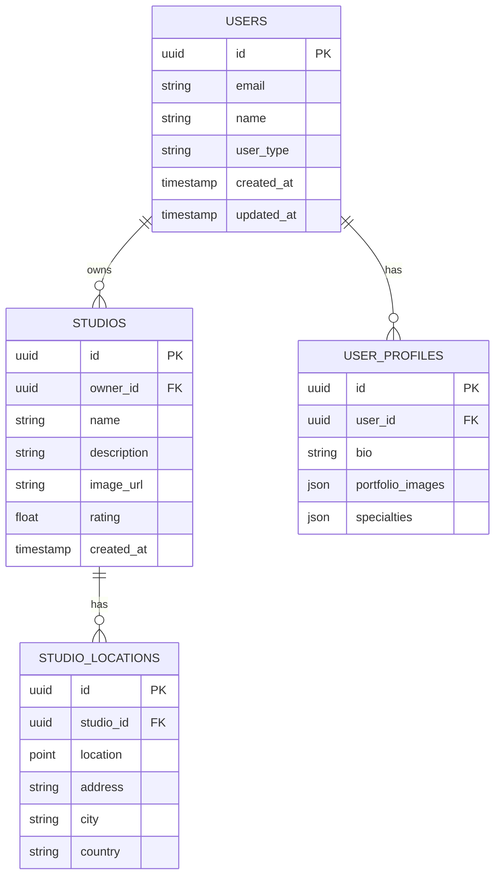

# InkLink Landing Page Redesign - Documento de Arquitectura Técnica

## 1. Diseño de Arquitectura



## 2. Descripción de Tecnologías

- **Frontend**: Next.js@14 + React@18 + TypeScript + Tailwind CSS@3
- **Animaciones**: GSAP@3.12 + ScrollTrigger + MotionPath
- **3D Graphics**: Three.js@0.158 + React Three Fiber@8.15
- **Globo Terráqueo**: Custom Three.js implementation con texturas de alta resolución
- **Backend**: Supabase (PostgreSQL + PostGIS)
- **Autenticación**: Supabase Auth (Google, Facebook, Email)
- **Bundler**: Vite para optimización de performance

## 3. Definiciones de Rutas

| Ruta | Propósito |
|------|----------|
| / | Landing page principal con globo interactivo y animaciones |
| /register | Página de registro con formulario multi-paso |
| /login | Página de login con opciones de autenticación social |
| /dashboard | Dashboard principal (redirige después del login) |
| /api/studios/locations | API endpoint para obtener ubicaciones de estudios |
| /api/auth/callback | Callback para autenticación social |

## 4. Definiciones de API

### 4.1 API Principal

**Obtener ubicaciones de estudios para el globo**
```
GET /api/studios/locations
```

Response:
| Nombre del Parámetro | Tipo de Parámetro | Descripción |
|---------------------|-------------------|-------------|
| studios | array | Lista de estudios con coordenadas |
| id | string | ID único del estudio |
| name | string | Nombre del estudio |
| latitude | number | Latitud de la ubicación |
| longitude | number | Longitud de la ubicación |
| rating | number | Calificación promedio |
| image_url | string | URL de imagen del estudio |

Ejemplo:
```json
{
  "studios": [
    {
      "id": "studio-1",
      "name": "Ink Masters Studio",
      "latitude": 40.7128,
      "longitude": -74.0060,
      "rating": 4.8,
      "image_url": "https://example.com/studio1.jpg"
    }
  ]
}
```

**Registro de usuario**
```
POST /api/auth/register
```

Request:
| Nombre del Parámetro | Tipo de Parámetro | Requerido | Descripción |
|---------------------|-------------------|-----------|-------------|
| email | string | true | Email del usuario |
| password | string | true | Contraseña |
| user_type | string | true | Tipo de usuario (client, artist, studio) |
| name | string | true | Nombre completo |

## 5. Arquitectura del Servidor



## 6. Modelo de Datos

### 6.1 Definición del Modelo de Datos



### 6.2 Lenguaje de Definición de Datos

**Tabla de Usuarios (users)**
```sql
-- Crear tabla de usuarios
CREATE TABLE users (
    id UUID PRIMARY KEY DEFAULT gen_random_uuid(),
    email VARCHAR(255) UNIQUE NOT NULL,
    name VARCHAR(100) NOT NULL,
    user_type VARCHAR(20) DEFAULT 'client' CHECK (user_type IN ('client', 'artist', 'studio')),
    created_at TIMESTAMP WITH TIME ZONE DEFAULT NOW(),
    updated_at TIMESTAMP WITH TIME ZONE DEFAULT NOW()
);

-- Crear índices
CREATE INDEX idx_users_email ON users(email);
CREATE INDEX idx_users_user_type ON users(user_type);

-- Permisos
GRANT SELECT ON users TO anon;
GRANT ALL PRIVILEGES ON users TO authenticated;
```

**Tabla de Estudios (studios)**
```sql
-- Crear tabla de estudios
CREATE TABLE studios (
    id UUID PRIMARY KEY DEFAULT gen_random_uuid(),
    owner_id UUID REFERENCES users(id),
    name VARCHAR(200) NOT NULL,
    description TEXT,
    image_url VARCHAR(500),
    rating DECIMAL(3,2) DEFAULT 0.0,
    created_at TIMESTAMP WITH TIME ZONE DEFAULT NOW()
);

-- Crear índices
CREATE INDEX idx_studios_owner_id ON studios(owner_id);
CREATE INDEX idx_studios_rating ON studios(rating DESC);

-- Permisos
GRANT SELECT ON studios TO anon;
GRANT ALL PRIVILEGES ON studios TO authenticated;
```

**Tabla de Ubicaciones de Estudios (studio_locations)**
```sql
-- Habilitar extensión PostGIS
CREATE EXTENSION IF NOT EXISTS postgis;

-- Crear tabla de ubicaciones
CREATE TABLE studio_locations (
    id UUID PRIMARY KEY DEFAULT gen_random_uuid(),
    studio_id UUID REFERENCES studios(id),
    location POINT NOT NULL,
    address VARCHAR(300),
    city VARCHAR(100),
    country VARCHAR(100),
    created_at TIMESTAMP WITH TIME ZONE DEFAULT NOW()
);

-- Crear índices espaciales
CREATE INDEX idx_studio_locations_location ON studio_locations USING GIST(location);
CREATE INDEX idx_studio_locations_studio_id ON studio_locations(studio_id);

-- Permisos
GRANT SELECT ON studio_locations TO anon;
GRANT ALL PRIVILEGES ON studio_locations TO authenticated;

-- Datos iniciales de ejemplo
INSERT INTO studios (name, description, rating) VALUES 
('Ink Masters NYC', 'Premier tattoo studio in Manhattan', 4.8),
('Tokyo Ink', 'Traditional Japanese tattoo art', 4.9),
('Berlin Tattoo Collective', 'Modern European tattoo styles', 4.7),
('LA Ink Studio', 'Celebrity tattoo destination', 4.6);

INSERT INTO studio_locations (studio_id, location, address, city, country)
SELECT 
    s.id,
    CASE 
        WHEN s.name = 'Ink Masters NYC' THEN POINT(-74.0060, 40.7128)
        WHEN s.name = 'Tokyo Ink' THEN POINT(139.6917, 35.6895)
        WHEN s.name = 'Berlin Tattoo Collective' THEN POINT(13.4050, 52.5200)
        WHEN s.name = 'LA Ink Studio' THEN POINT(-118.2437, 34.0522)
    END,
    CASE 
        WHEN s.name = 'Ink Masters NYC' THEN '123 Broadway, Manhattan'
        WHEN s.name = 'Tokyo Ink' THEN '456 Shibuya District'
        WHEN s.name = 'Berlin Tattoo Collective' THEN '789 Kreuzberg Street'
        WHEN s.name = 'LA Ink Studio' THEN '321 Sunset Boulevard'
    END,
    CASE 
        WHEN s.name = 'Ink Masters NYC' THEN 'New York'
        WHEN s.name = 'Tokyo Ink' THEN 'Tokyo'
        WHEN s.name = 'Berlin Tattoo Collective' THEN 'Berlin'
        WHEN s.name = 'LA Ink Studio' THEN 'Los Angeles'
    END,
    CASE 
        WHEN s.name = 'Ink Masters NYC' THEN 'USA'
        WHEN s.name = 'Tokyo Ink' THEN 'Japan'
        WHEN s.name = 'Berlin Tattoo Collective' THEN 'Germany'
        WHEN s.name = 'LA Ink Studio' THEN 'USA'
    END
FROM studios s;
```