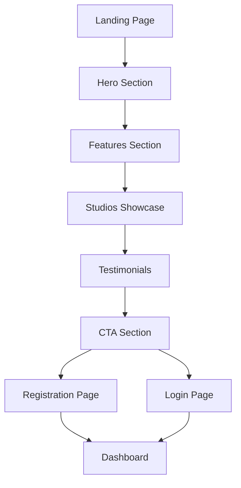

# InkLink Landing Page Redesign - Documento de Requerimientos del Producto

## 1. Descripción General del Producto

Rediseño completo de la landing page de InkLink con una experiencia visual inmersiva que incluye animaciones fluidas, un globo terráqueo interactivo y un diseño minimalista elegante en esquema de colores oscuro.

El objetivo es crear una experiencia de usuario moderna y atractiva que represente visualmente la naturaleza global de la plataforma de tatuajes, utilizando tecnologías de animación avanzadas para mejorar la conversión y el engagement.

## 2. Características Principales

### 2.1 Roles de Usuario

| Rol | Método de Registro | Permisos Principales |
|-----|-------------------|---------------------|
| Visitante | No requiere registro | Puede navegar la landing page, ver animaciones interactivas |
| Cliente | Registro por email/Google/Facebook | Puede registrarse desde la landing page, acceder al mapa |
| Artista | Registro por email/Google/Facebook | Puede registrarse como artista desde la landing page |
| Estudio | Registro por email/Google/Facebook | Puede registrarse como estudio desde la landing page |

### 2.2 Módulos de Características

Nuestra landing page rediseñada consta de las siguientes páginas principales:

1. **Landing Page Principal**: sección hero con globo terráqueo, secciones de características, testimonios, CTA de registro
2. **Página de Registro**: formulario de registro con opciones de rol, integración con auth social
3. **Página de Login**: formulario de acceso con opciones sociales

### 2.3 Detalles de Páginas

| Nombre de Página | Nombre del Módulo | Descripción de Características |
|------------------|-------------------|-------------------------------|
| Landing Page Principal | Hero Section | Globo terráqueo interactivo 3D con marcadores de estudios, animaciones GSAP de entrada, texto principal animado |
| Landing Page Principal | Features Section | Tarjetas de características con animaciones de scroll, iconografía minimalista, efectos hover |
| Landing Page Principal | Studios Showcase | Visualización de estudios destacados sobre el globo con efectos de partículas, transiciones suaves |
| Landing Page Principal | Testimonials Section | Carrusel de testimonios con animaciones coordinadas, avatares animados |
| Landing Page Principal | CTA Section | Botones de registro animados, efectos de hover, transiciones fluidas |
| Landing Page Principal | Footer | Enlaces de navegación, información de contacto, animaciones sutiles |
| Página de Registro | Registration Form | Formulario multi-paso con validación, selección de rol, integración auth social |
| Página de Login | Login Form | Formulario de acceso, recuperación de contraseña, opciones sociales |

## 3. Proceso Principal

**Flujo de Usuario Visitante:**
1. El usuario llega a la landing page
2. Ve las animaciones de entrada del hero con el globo terráqueo
3. Interactúa con el globo para explorar estudios
4. Navega por las secciones con scroll animado
5. Hace clic en CTA de registro
6. Completa el proceso de registro
7. Es redirigido al dashboard correspondiente

**Flujo de Navegación:**

## 4. Diseño de Interfaz de Usuario

### 4.1 Estilo de Diseño

- **Colores primarios**: Negro (#000000), Blanco (#FFFFFF)
- **Colores secundarios**: Gris oscuro (#1a1a1a), Gris medio (#333333)
- **Colores de acento**: Azul eléctrico (#00D4FF), Verde neón (#00FF88)
- **Estilo de botones**: Bordes redondeados (8px), efectos de hover con glow
- **Tipografía**: Inter (títulos), Roboto (cuerpo), tamaños 16px-48px
- **Estilo de layout**: Grid moderno, espaciado generoso, componentes flotantes
- **Iconos**: Minimalistas, líneas finas, animaciones micro-interactivas

### 4.2 Resumen de Diseño de Páginas

| Nombre de Página | Nombre del Módulo | Elementos de UI |
|------------------|-------------------|----------------|
| Landing Page Principal | Hero Section | Globo 3D interactivo, texto animado con typewriter effect, partículas flotantes, gradientes sutiles |
| Landing Page Principal | Features Section | Cards con glass morphism, iconos animados, efectos parallax, transiciones stagger |
| Landing Page Principal | Studios Showcase | Marcadores 3D sobre globo, tooltips animados, efectos de conexión entre puntos |
| Landing Page Principal | Testimonials | Carrusel con fade transitions, avatares con border glow, texto con reveal animation |
| Landing Page Principal | CTA Section | Botones con ripple effect, background con moving gradient, call-to-action pulsante |
| Página de Registro | Registration Form | Formulario con floating labels, validación en tiempo real, progress indicator animado |

### 4.3 Responsividad

Diseño mobile-first con breakpoints optimizados para desktop, tablet y móvil. El globo terráqueo se adapta al tamaño de pantalla manteniendo la interactividad. Las animaciones se simplifican en dispositivos móviles para optimizar el rendimiento.