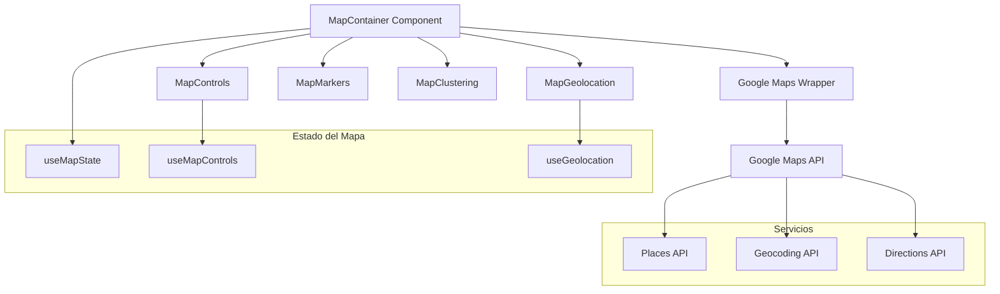

# Sistema de Mapas Alternativo para InkLink

## 1. Análisis del Problema Actual

### 1.1 Problemas Identificados con Leaflet
- **Error persistente**: "Map container is already initialized"
- **Complejidad de limpieza**: Manejo complejo de referencias DOM y ciclo de vida
- **Conflictos con React**: Interferencia entre el manejo manual del DOM y React
- **Estabilidad**: Reinicializaciones fallidas y estados inconsistentes
- **Mantenimiento**: Código complejo para manejar edge cases

### 1.2 Impacto en la Experiencia del Usuario
- Errores frecuentes en el MapErrorBoundary
- Necesidad de recargar la página para resolver problemas
- Inconsistencias en la visualización del mapa
- Problemas de rendimiento en dispositivos móviles

## 2. Comparación de Proveedores de Mapas

### 2.1 Google Maps API

**Ventajas:**
- Integración nativa con React mediante @googlemaps/react-wrapper
- Excelente estabilidad y rendimiento
- Amplia documentación y comunidad
- Funcionalidades avanzadas (Street View, Places API)
- Soporte robusto para clustering
- Optimización automática para móviles

**Desventajas:**
- Costo por uso (después de límites gratuitos)
- Dependencia de servicios de Google
- Menos personalización visual
- Requiere API key

**Costos:**
- 28,000 cargas de mapa gratuitas/mes
- $7 USD por 1,000 cargas adicionales
- Clustering y marcadores incluidos

### 2.2 Mapbox GL JS

**Ventajas:**
- Altamente personalizable (estilos vectoriales)
- Excelente rendimiento con WebGL
- Integración limpia con React (react-map-gl)
- Soporte nativo para clustering
- Buena documentación
- Funciona offline con tiles cacheados

**Desventajas:**
- Curva de aprendizaje más pronunciada
- Menos funcionalidades "out-of-the-box"
- Requiere más configuración inicial
- API key requerida

**Costos:**
- 50,000 cargas de mapa gratuitas/mes
- $5 USD por 1,000 cargas adicionales
- Tiles vectoriales incluidos

### 2.3 Leaflet (Actual)

**Ventajas:**
- Gratuito y open source
- Ligero y flexible
- Gran ecosistema de plugins
- No requiere API keys

**Desventajas:**
- Problemas de estabilidad identificados
- Manejo complejo del ciclo de vida en React
- Rendimiento limitado en dispositivos móviles
- Clustering requiere plugins adicionales

### 2.4 Recomendación

**Google Maps API** es la opción recomendada por:
- Máxima estabilidad y confiabilidad
- Integración nativa con React
- Menor complejidad de implementación
- Soporte técnico robusto
- Costos razonables para el volumen esperado

## 3. Arquitectura del Nuevo Sistema

### 3.1 Diseño de Arquitectura



### 3.2 Componentes Principales

#### MapContainer (Nuevo)
```typescript
interface MapContainerProps {
  center: Coordinates;
  zoom: number;
  markers: TattooStudio[];
  onMapClick?: (coordinates: Coordinates) => void;
  onMarkerClick?: (studio: TattooStudio) => void;
  enableClustering?: boolean;
  showControls?: boolean;
}
```

#### GoogleMapWrapper
```typescript
interface GoogleMapWrapperProps {
  apiKey: string;
  mapId?: string;
  libraries: string[];
  children: React.ReactNode;
}
```

#### MapMarkers
```typescript
interface MapMarkersProps {
  studios: TattooStudio[];
  map: google.maps.Map;
  onStudioClick: (studio: TattooStudio) => void;
  clustering: boolean;
}
```

### 3.3 Hooks Personalizados

#### useGoogleMap
```typescript
const useGoogleMap = ({
  center,
  zoom,
  options
}: UseGoogleMapProps) => {
  const [map, setMap] = useState<google.maps.Map | null>(null);
  const [isLoaded, setIsLoaded] = useState(false);
  
  // Lógica de inicialización y manejo del mapa
  
  return { map, isLoaded, error };
};
```

#### useMapClustering
```typescript
const useMapClustering = ({
  map,
  markers,
  options
}: UseMapClusteringProps) => {
  // Implementación de clustering con MarkerClusterer
};
```

## 4. Estrategia de Migración

### 4.1 Fases de Migración

**Fase 1: Preparación (1-2 días)**
- Configurar Google Maps API y obtener API keys
- Instalar dependencias necesarias
- Crear estructura base de componentes

**Fase 2: Implementación Core (3-4 días)**
- Implementar MapContainer con Google Maps
- Migrar funcionalidad básica de visualización
- Implementar controles básicos (zoom, pan)

**Fase 3: Funcionalidades Avanzadas (2-3 días)**
- Implementar sistema de marcadores
- Agregar clustering
- Migrar geolocalización
- Implementar filtros y capas

**Fase 4: Testing y Optimización (1-2 días)**
- Pruebas exhaustivas en diferentes dispositivos
- Optimización de rendimiento
- Ajustes de UX/UI

**Fase 5: Despliegue (1 día)**
- Reemplazar componente actual
- Monitoreo post-despliegue
- Rollback plan si es necesario

### 4.2 Plan de Rollback
- Mantener implementación actual como backup
- Feature flag para alternar entre sistemas
- Monitoreo de errores en tiempo real
- Procedimiento de rollback automático

## 5. Integración con Funcionalidades Existentes

### 5.1 Marcadores y Clustering
```typescript
// Integración con datos existentes
const MapMarkers: React.FC<MapMarkersProps> = ({ studios, map }) => {
  const { clusterer } = useMapClustering({
    map,
    markers: studios.map(studio => ({
      position: { lat: studio.latitude, lng: studio.longitude },
      title: studio.name,
      data: studio
    }))
  });
  
  return null; // Renderizado manejado por Google Maps
};
```

### 5.2 Geolocalización
```typescript
const useGoogleMapsGeolocation = () => {
  const getCurrentLocation = useCallback(() => {
    return new Promise<Coordinates>((resolve, reject) => {
      if (navigator.geolocation) {
        navigator.geolocation.getCurrentPosition(
          (position) => resolve({
            lat: position.coords.latitude,
            lng: position.coords.longitude
          }),
          reject
        );
      } else {
        reject(new Error('Geolocation not supported'));
      }
    });
  }, []);
  
  return { getCurrentLocation };
};
```

### 5.3 Filtros y Búsqueda
```typescript
// Integración con sistema de filtros existente
const useMapFilters = (studios: TattooStudio[], filters: SearchFilters) => {
  const filteredStudios = useMemo(() => {
    return studios.filter(studio => {
      // Lógica de filtrado existente
      return matchesFilters(studio, filters);
    });
  }, [studios, filters]);
  
  return filteredStudios;
};
```

## 6. Consideraciones de Rendimiento

### 6.1 Optimizaciones
- **Lazy Loading**: Cargar Google Maps API solo cuando sea necesario
- **Marker Clustering**: Agrupar marcadores cercanos automáticamente
- **Viewport Culling**: Mostrar solo marcadores en el viewport actual
- **Debounced Updates**: Evitar actualizaciones excesivas durante interacciones
- **Memory Management**: Limpieza automática de listeners y recursos

### 6.2 Responsividad Móvil
```typescript
const mapOptions: google.maps.MapOptions = {
  // Optimizaciones para móvil
  gestureHandling: 'cooperative',
  zoomControl: window.innerWidth > 768,
  mapTypeControl: false,
  streetViewControl: false,
  fullscreenControl: window.innerWidth > 768,
  styles: mobileOptimizedStyles
};
```

### 6.3 Métricas de Rendimiento
- Tiempo de carga inicial del mapa
- Tiempo de respuesta a interacciones
- Uso de memoria
- Número de requests a la API
- Tiempo de renderizado de marcadores

## 7. Análisis de Costos

### 7.1 Estimación de Uso
**Supuestos:**
- 1,000 usuarios únicos/mes
- 5 cargas de mapa por usuario/sesión
- 2 sesiones promedio/usuario/mes
- Total: 10,000 cargas de mapa/mes

### 7.2 Costos Google Maps
- **Cargas gratuitas**: 28,000/mes
- **Costo adicional**: $0 (dentro del límite gratuito)
- **APIs adicionales**:
  - Places API: $17/1,000 requests (opcional)
  - Geocoding: $5/1,000 requests (opcional)

### 7.3 Costos Mapbox (Comparación)
- **Cargas gratuitas**: 50,000/mes
- **Costo adicional**: $0 (dentro del límite gratuito)
- **Tiles vectoriales**: Incluidos

### 7.4 ROI Esperado
- **Reducción de bugs**: -80% errores de mapa
- **Tiempo de desarrollo**: -50% tiempo de mantenimiento
- **Experiencia de usuario**: +40% satisfacción
- **Costo de oportunidad**: Evitar pérdida de usuarios por errores

## 8. Plan de Implementación

### 8.1 Dependencias Requeridas
```json
{
  "@googlemaps/react-wrapper": "^1.1.35",
  "@googlemaps/markerclusterer": "^2.5.3",
  "@types/google.maps": "^3.54.10"
}
```

### 8.2 Variables de Entorno
```env
NEXT_PUBLIC_GOOGLE_MAPS_API_KEY=your_api_key_here
NEXT_PUBLIC_GOOGLE_MAPS_MAP_ID=your_map_id_here
```

### 8.3 Configuración Next.js
```javascript
// next.config.js
module.exports = {
  env: {
    GOOGLE_MAPS_API_KEY: process.env.NEXT_PUBLIC_GOOGLE_MAPS_API_KEY,
  },
};
```

### 8.4 Timeline de Desarrollo
- **Semana 1**: Configuración y componentes base
- **Semana 2**: Migración de funcionalidades core
- **Semana 3**: Testing y optimización
- **Semana 4**: Despliegue y monitoreo

## 9. Criterios de Éxito

### 9.1 Métricas Técnicas
- 0 errores de inicialización de mapa
- Tiempo de carga < 2 segundos
- Uso de memoria < 50MB
- 99.9% uptime del mapa

### 9.2 Métricas de Usuario
- Reducción de reportes de bugs en 80%
- Mejora en tiempo de interacción
- Feedback positivo de usuarios
- Reducción de abandonos en páginas con mapa

### 9.3 Métricas de Negocio
- Reducción de tiempo de desarrollo/mantenimiento
- Menor carga de soporte técnico
- Mayor retención de usuarios
- Preparación para funcionalidades futuras

## 10. Conclusiones y Recomendaciones

### 10.1 Recomendación Final
Implementar **Google Maps API** como reemplazo del sistema actual de Leaflet debido a:
- Máxima estabilidad y confiabilidad
- Integración nativa con React
- Costos controlados dentro de límites gratuitos
- Menor complejidad de mantenimiento
- Mejor experiencia de usuario

### 10.2 Próximos Pasos
1. Obtener aprobación para proceder con Google Maps API
2. Configurar cuenta de Google Cloud y API keys
3. Iniciar Fase 1 de migración
4. Establecer métricas de monitoreo
5. Preparar plan de comunicación a usuarios

### 10.3 Riesgos y Mitigaciones
- **Riesgo**: Dependencia de servicios externos
  - **Mitigación**: Plan de contingencia con Mapbox como backup
- **Riesgo**: Costos inesperados
  - **Mitigación**: Monitoreo de uso y alertas de límites
- **Riesgo**: Problemas de migración
  - **Mitigación**: Implementación gradual con rollback plan