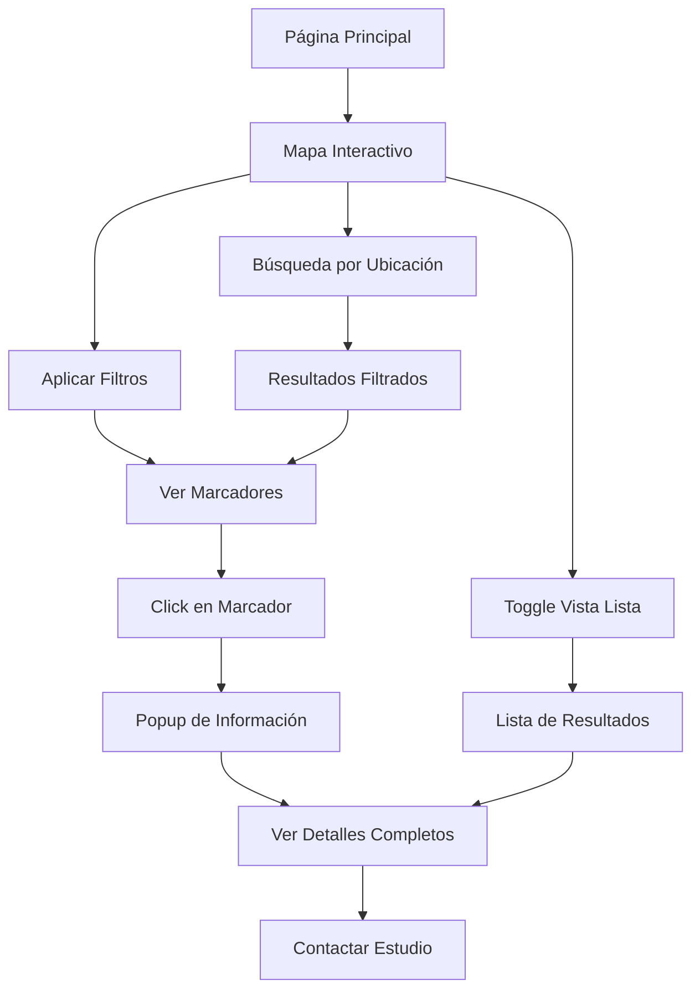

# Sistema de Mapas Alternativo - Documento de Requerimientos del Producto

## 1. Resumen del Producto

Implementación de un nuevo sistema de mapas para InkLink que reemplace la solución actual basada en Leaflet, utilizando Google Maps API para proporcionar una experiencia más estable, confiable y rica en funcionalidades para la localización de estudios de tatuajes y artistas.

El nuevo sistema resolverá los problemas críticos de inicialización y estabilidad del mapa actual, mejorando significativamente la experiencia del usuario y reduciendo la carga de mantenimiento técnico.

## 2. Funcionalidades Principales

### 2.1 Roles de Usuario

| Rol | Método de Registro | Permisos Principales |
|-----|-------------------|---------------------|
| Cliente | Email/Google/Facebook | Buscar estudios, ver perfiles, solicitar citas |
| Artista | Invitación + verificación | Gestionar perfil, portfolio, recibir solicitudes |
| Estudio | Registro comercial | Gestionar múltiples artistas, ubicación, servicios |
| Administrador | Acceso interno | Gestión completa del sistema y contenido |

### 2.2 Módulos de Funcionalidad

Nuestro nuevo sistema de mapas consistirá en las siguientes páginas principales:

1. **Página de Mapa Principal**: visualización interactiva, marcadores de estudios, controles de navegación, filtros de búsqueda
2. **Panel de Filtros**: criterios de búsqueda, rango de precios, estilos de tatuaje, disponibilidad
3. **Vista de Detalles de Estudio**: información completa, galería, artistas, reseñas, botón de contacto
4. **Geolocalización**: detección automática de ubicación, búsqueda por proximidad
5. **Vista de Lista**: alternativa al mapa, resultados en formato lista

### 2.3 Detalles de Páginas

| Página | Módulo | Descripción de Funcionalidad |
|--------|--------|------------------------------|
| Mapa Principal | Visualización del Mapa | Renderizar mapa interactivo con Google Maps, navegación fluida, zoom responsive |
| Mapa Principal | Sistema de Marcadores | Mostrar estudios como marcadores, clustering automático, iconos personalizados |
| Mapa Principal | Controles de Navegación | Zoom in/out, reset de vista, toggle de capas, botón de geolocalización |
| Mapa Principal | Barra de Búsqueda | Búsqueda por ubicación, autocompletado con Places API |
| Panel de Filtros | Filtros de Búsqueda | Filtrar por estilo, precio, rating, disponibilidad, distancia |
| Panel de Filtros | Aplicación de Filtros | Actualización en tiempo real del mapa, contador de resultados |
| Vista de Detalles | Información del Estudio | Nombre, dirección, teléfono, horarios, descripción |
| Vista de Detalles | Galería de Trabajos | Portfolio de tatuajes, filtros por artista, zoom de imágenes |
| Vista de Detalles | Lista de Artistas | Perfiles de artistas, especialidades, disponibilidad |
| Vista de Detalles | Sistema de Reseñas | Calificaciones, comentarios, respuestas del estudio |
| Vista de Detalles | Acciones de Contacto | Botón de llamada, WhatsApp, formulario de consulta |
| Geolocalización | Detección de Ubicación | Solicitar permisos, obtener coordenadas, manejo de errores |
| Geolocalización | Búsqueda por Proximidad | Ordenar resultados por distancia, radio de búsqueda configurable |
| Vista de Lista | Resultados Alternativos | Lista de estudios con información resumida, paginación |
| Vista de Lista | Toggle Vista | Alternar entre mapa y lista, mantener filtros aplicados |

## 3. Flujo Principal de Usuario

### Flujo de Búsqueda de Estudios

1. **Acceso al Mapa**: Usuario accede a la página principal con mapa
2. **Geolocalización**: Sistema solicita permisos de ubicación (opcional)
3. **Visualización Inicial**: Mapa se centra en ubicación del usuario o ciudad por defecto
4. **Aplicación de Filtros**: Usuario selecciona criterios de búsqueda
5. **Exploración**: Usuario navega el mapa, ve marcadores agrupados
6. **Selección de Estudio**: Click en marcador muestra información básica
7. **Vista Detallada**: Click en "Ver más" abre página completa del estudio
8. **Acción de Contacto**: Usuario puede llamar, enviar mensaje o solicitar cita

### Flujo de Navegación

## 4. Diseño de Interfaz de Usuario

### 4.1 Estilo de Diseño

- **Colores Primarios**: 
  - Primario: #1a1a1a (Negro profundo)
  - Secundario: #ff6b35 (Naranja vibrante)
  - Acento: #f7f7f7 (Gris claro)
- **Estilo de Botones**: Redondeados con sombras sutiles, efectos hover suaves
- **Tipografía**: 
  - Títulos: Geist Sans Bold, 24px-32px
  - Cuerpo: Geist Sans Regular, 14px-16px
  - Etiquetas: Geist Sans Medium, 12px-14px
- **Layout**: Diseño de tarjetas con bordes redondeados, navegación lateral colapsible
- **Iconografía**: Iconos de Lucide React, estilo minimalista, tamaño 20px-24px

### 4.2 Diseño de Páginas

| Página | Módulo | Elementos de UI |
|--------|--------|-----------------|
| Mapa Principal | Contenedor del Mapa | Altura completa de viewport, bordes redondeados, sombra sutil |
| Mapa Principal | Controles de Navegación | Botones flotantes en esquina superior derecha, fondo blanco semi-transparente |
| Mapa Principal | Barra de Búsqueda | Input con icono de búsqueda, autocompletado dropdown, posición superior central |
| Panel de Filtros | Sidebar de Filtros | Panel lateral izquierdo colapsible, fondo blanco, separadores sutiles |
| Panel de Filtros | Controles de Filtro | Checkboxes personalizados, sliders para rangos, botones de reset |
| Vista de Detalles | Modal de Información | Overlay semi-transparente, modal centrado, botón de cierre prominente |
| Vista de Detalles | Galería de Imágenes | Grid responsivo, lightbox para zoom, navegación por flechas |
| Marcadores | Iconos de Estudio | Iconos personalizados con colores de marca, clustering con números |
| Marcadores | Popup de Información | Tarjeta flotante con sombra, información esencial, botón CTA |

### 4.3 Responsividad

**Enfoque Mobile-First** con adaptaciones específicas:
- **Móvil (< 768px)**: Mapa de altura completa, filtros en modal bottom-sheet, controles simplificados
- **Tablet (768px - 1024px)**: Sidebar de filtros colapsible, controles de tamaño medio
- **Desktop (> 1024px)**: Layout completo con sidebar fijo, todos los controles visibles

**Optimizaciones Táctiles**:
- Botones con área mínima de 44px
- Gestos de pellizco para zoom
- Arrastre suave para navegación
- Feedback háptico en dispositivos compatibles

## 5. Requerimientos Técnicos

### 5.1 Rendimiento
- Tiempo de carga inicial del mapa: < 2 segundos
- Respuesta a interacciones: < 100ms
- Renderizado de marcadores: < 500ms para 100+ marcadores
- Uso de memoria: < 50MB en dispositivos móviles

### 5.2 Compatibilidad
- Navegadores: Chrome 90+, Firefox 88+, Safari 14+, Edge 90+
- Dispositivos móviles: iOS 13+, Android 8+
- Resoluciones: 320px - 2560px de ancho

### 5.3 Accesibilidad
- Cumplimiento WCAG 2.1 AA
- Navegación por teclado completa
- Lectores de pantalla compatibles
- Alto contraste disponible
- Texto alternativo para todos los elementos visuales

### 5.4 SEO y Metadatos
- URLs amigables para ubicaciones
- Meta tags dinámicos por área geográfica
- Schema markup para negocios locales
- Sitemap XML con ubicaciones

## 6. Criterios de Aceptación

### 6.1 Funcionalidad Core
- ✅ Mapa se carga sin errores de inicialización
- ✅ Marcadores se muestran correctamente en todas las resoluciones
- ✅ Filtros actualizan resultados en tiempo real
- ✅ Geolocalización funciona con manejo de errores
- ✅ Clustering agrupa marcadores automáticamente

### 6.2 Experiencia de Usuario
- ✅ Navegación fluida sin lag perceptible
- ✅ Interfaz intuitiva sin necesidad de tutorial
- ✅ Información de estudios fácilmente accesible
- ✅ Proceso de contacto simplificado
- ✅ Feedback visual para todas las acciones

### 6.3 Estabilidad
- ✅ 0 errores críticos de JavaScript
- ✅ Manejo graceful de errores de red
- ✅ Recuperación automática de fallos temporales
- ✅ Estado consistente durante navegación
- ✅ Limpieza adecuada de recursos

## 7. Métricas de Éxito

### 7.1 Métricas Técnicas
- **Tasa de Error**: < 0.1% de sesiones con errores
- **Tiempo de Carga**: 95% de cargas en < 3 segundos
- **Disponibilidad**: 99.9% uptime
- **Rendimiento**: Core Web Vitals en verde

### 7.2 Métricas de Usuario
- **Engagement**: +25% tiempo en página con mapa
- **Conversión**: +15% clicks en información de estudios
- **Satisfacción**: Rating > 4.5/5 en feedback
- **Retención**: -20% tasa de rebote en páginas con mapa

### 7.3 Métricas de Negocio
- **Contactos**: +30% solicitudes de información
- **Citas**: +20% reservas completadas
- **Costos**: -50% tiempo de soporte técnico
- **Escalabilidad**: Soporte para 10x más usuarios concurrentes

## 8. Fases de Implementación

### Fase 1: Fundación (Semana 1)
- Configuración de Google Maps API
- Componente base de mapa
- Integración con datos existentes
- Testing básico de funcionalidad

### Fase 2: Funcionalidades Core (Semana 2)
- Sistema de marcadores y clustering
- Controles de navegación
- Filtros básicos
- Geolocalización

### Fase 3: Experiencia de Usuario (Semana 3)
- Vista de detalles de estudios
- Optimizaciones de rendimiento
- Diseño responsive
- Accesibilidad

### Fase 4: Lanzamiento (Semana 4)
- Testing exhaustivo
- Migración gradual
- Monitoreo y métricas
- Documentación de usuario

## 9. Riesgos y Mitigaciones

### 9.1 Riesgos Técnicos
- **Límites de API**: Monitoreo de uso y alertas
- **Rendimiento**: Testing en dispositivos de gama baja
- **Compatibilidad**: Testing cross-browser automatizado

### 9.2 Riesgos de Usuario
- **Curva de Aprendizaje**: Onboarding y tooltips
- **Privacidad**: Permisos claros y opcionales
- **Accesibilidad**: Testing con usuarios reales

### 9.3 Riesgos de Negocio
- **Costos**: Plan de escalamiento gradual
- **Dependencia**: Plan de contingencia con Mapbox
- **Timeline**: Buffer de tiempo para imprevistos

## 10. Conclusión

El nuevo sistema de mapas basado en Google Maps API proporcionará una experiencia significativamente mejorada para los usuarios de InkLink, eliminando los problemas críticos de estabilidad actuales y estableciendo una base sólida para futuras funcionalidades. La implementación seguirá un enfoque gradual y medido para minimizar riesgos y maximizar el valor entregado a usuarios y negocio.