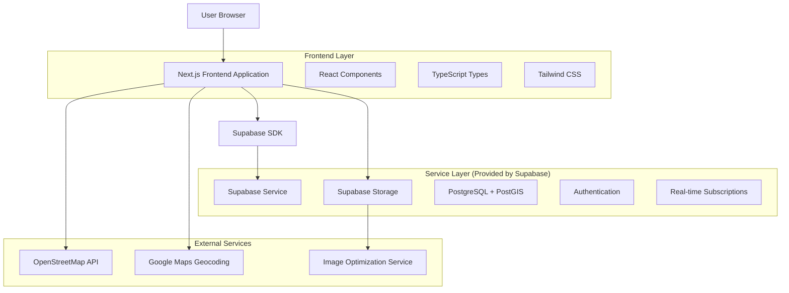
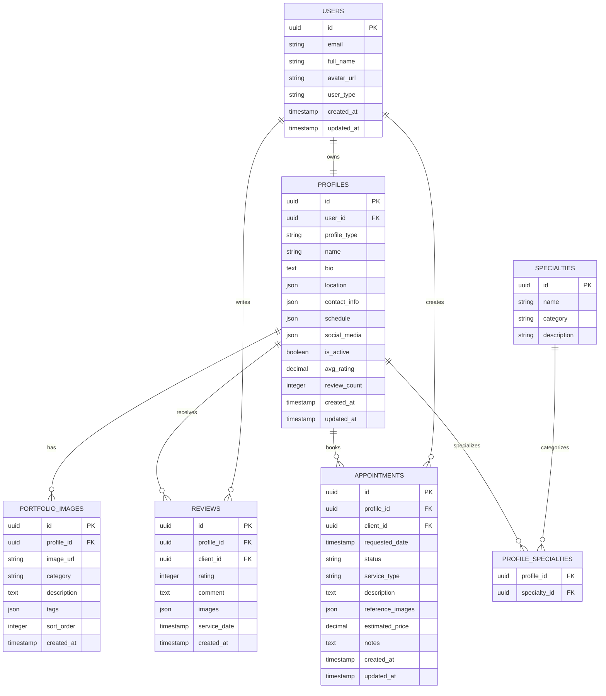

# Arquitectura Técnica - Sistema de Perfiles Profesionales

## 1. Architecture design



## 2. Technology Description

- Frontend: Next.js@14 + React@18 + TypeScript@5 + Tailwind CSS@3 + React Bits (shadcn/ui)
- Backend: Supabase (PostgreSQL + PostGIS + Auth + Storage + Real-time)
- Maps: OpenStreetMap + Leaflet
- Image Storage: Supabase Storage
- State Management: React Query + Zustand
- Form Handling: React Hook Form + Zod
- UI Components: React Bits (shadcn/ui) + Lucide React

## 3. Route definitions

| Route | Purpose |
|-------|---------|
| /profiles | Página principal de búsqueda y listado de perfiles |
| /profiles/studios | Listado específico de estudios de tatuajes |
| /profiles/artists | Listado específico de tatuadores individuales |
| /studio/[id] | Perfil detallado de estudio de tatuajes |
| /artist/[id] | Perfil detallado de tatuador individual |
| /profile/edit | Editor de perfil para usuarios autenticados |
| /profile/portfolio | Gestión de portfolio e imágenes |
| /appointments | Sistema de gestión de citas |
| /appointments/book/[profileId] | Programar nueva cita con un profesional |
| /reviews | Sistema de valoraciones y reseñas |
| /dashboard/professional | Panel de control para tatuadores y estudios |

## 4. API definitions

### 4.1 Core API

**Gestión de Perfiles**
```
GET /api/profiles
```
Request:
| Param Name | Param Type | isRequired | Description |
|------------|------------|------------|-------------|
| type | string | false | Tipo de perfil: 'studio' o 'artist' |
| location | string | false | Ubicación para búsqueda geográfica |
| radius | number | false | Radio de búsqueda en kilómetros |
| styles | string[] | false | Estilos de tatuaje especializados |
| available | boolean | false | Solo perfiles con disponibilidad |
| page | number | false | Número de página para paginación |
| limit | number | false | Límite de resultados por página |

Response:
| Param Name | Param Type | Description |
|------------|------------|-------------|
| profiles | Profile[] | Array de perfiles encontrados |
| total | number | Total de resultados |
| page | number | Página actual |
| hasMore | boolean | Indica si hay más resultados |

**Crear/Actualizar Perfil**
```
POST /api/profiles
PUT /api/profiles/[id]
```
Request:
| Param Name | Param Type | isRequired | Description |
|------------|------------|------------|-------------|
| type | string | true | Tipo: 'studio' o 'artist' |
| name | string | true | Nombre del estudio o artista |
| bio | string | false | Biografía o descripción |
| location | object | true | Coordenadas y dirección |
| contact | object | true | Información de contacto |
| specialties | string[] | false | Especialidades y estilos |
| schedule | object | false | Horarios de trabajo |
| social_media | object | false | Enlaces a redes sociales |

**Gestión de Portfolio**
```
POST /api/profiles/[id]/portfolio
DELETE /api/profiles/[id]/portfolio/[imageId]
```
Request:
| Param Name | Param Type | isRequired | Description |
|------------|------------|------------|-------------|
| image | File | true | Archivo de imagen |
| category | string | false | Categoría o estilo del trabajo |
| description | string | false | Descripción del trabajo |
| tags | string[] | false | Tags asociados |

**Sistema de Citas**
```
POST /api/appointments
GET /api/appointments
PUT /api/appointments/[id]
```
Request (POST):
| Param Name | Param Type | isRequired | Description |
|------------|------------|------------|-------------|
| profile_id | string | true | ID del perfil profesional |
| client_id | string | true | ID del cliente |
| requested_date | string | true | Fecha solicitada (ISO) |
| service_type | string | true | Tipo de servicio |
| description | string | false | Descripción del tatuaje |
| reference_images | string[] | false | URLs de imágenes de referencia |

**Sistema de Valoraciones**
```
POST /api/reviews
GET /api/reviews/[profileId]
```
Request (POST):
| Param Name | Param Type | isRequired | Description |
|------------|------------|------------|-------------|
| profile_id | string | true | ID del perfil valorado |
| rating | number | true | Puntuación (1-5) |
| comment | string | false | Comentario de la reseña |
| service_date | string | false | Fecha del servicio |
| images | string[] | false | Imágenes del resultado |

## 5. Data model

### 5.1 Data model definition



### 5.2 Data Definition Language

**Tabla de Usuarios (users)**
```sql
-- Extender la tabla de usuarios de Supabase Auth
CREATE TABLE public.user_profiles (
    id UUID PRIMARY KEY REFERENCES auth.users(id) ON DELETE CASCADE,
    full_name VARCHAR(255),
    avatar_url TEXT,
    user_type VARCHAR(20) DEFAULT 'client' CHECK (user_type IN ('client', 'artist', 'studio', 'admin')),
    phone VARCHAR(20),
    created_at TIMESTAMP WITH TIME ZONE DEFAULT NOW(),
    updated_at TIMESTAMP WITH TIME ZONE DEFAULT NOW()
);

-- RLS policies
ALTER TABLE public.user_profiles ENABLE ROW LEVEL SECURITY;
CREATE POLICY "Users can view own profile" ON public.user_profiles FOR SELECT USING (auth.uid() = id);
CREATE POLICY "Users can update own profile" ON public.user_profiles FOR UPDATE USING (auth.uid() = id);
```

**Tabla de Perfiles Profesionales (profiles)**
```sql
CREATE TABLE public.profiles (
    id UUID PRIMARY KEY DEFAULT gen_random_uuid(),
    user_id UUID REFERENCES public.user_profiles(id) ON DELETE CASCADE,
    profile_type VARCHAR(20) NOT NULL CHECK (profile_type IN ('studio', 'artist')),
    name VARCHAR(255) NOT NULL,
    slug VARCHAR(255) UNIQUE,
    bio TEXT,
    location JSONB NOT NULL, -- {lat, lng, address, city, country}
    contact_info JSONB, -- {phone, email, website}
    schedule JSONB, -- {monday: {open, close, available}, ...}
    social_media JSONB, -- {instagram, facebook, tiktok, ...}
    is_active BOOLEAN DEFAULT true,
    is_verified BOOLEAN DEFAULT false,
    avg_rating DECIMAL(3,2) DEFAULT 0,
    review_count INTEGER DEFAULT 0,
    created_at TIMESTAMP WITH TIME ZONE DEFAULT NOW(),
    updated_at TIMESTAMP WITH TIME ZONE DEFAULT NOW()
);

-- Índices para búsqueda geoespacial
CREATE INDEX idx_profiles_location ON public.profiles USING GIN (location);
CREATE INDEX idx_profiles_type ON public.profiles (profile_type);
CREATE INDEX idx_profiles_active ON public.profiles (is_active) WHERE is_active = true;
CREATE INDEX idx_profiles_rating ON public.profiles (avg_rating DESC);

-- RLS policies
ALTER TABLE public.profiles ENABLE ROW LEVEL SECURITY;
CREATE POLICY "Profiles are viewable by everyone" ON public.profiles FOR SELECT USING (is_active = true);
CREATE POLICY "Users can manage own profiles" ON public.profiles FOR ALL USING (auth.uid() = user_id);
```

**Tabla de Imágenes de Portfolio (portfolio_images)**
```sql
CREATE TABLE public.portfolio_images (
    id UUID PRIMARY KEY DEFAULT gen_random_uuid(),
    profile_id UUID REFERENCES public.profiles(id) ON DELETE CASCADE,
    image_url TEXT NOT NULL,
    thumbnail_url TEXT,
    category VARCHAR(100),
    description TEXT,
    tags JSONB DEFAULT '[]',
    sort_order INTEGER DEFAULT 0,
    is_featured BOOLEAN DEFAULT false,
    created_at TIMESTAMP WITH TIME ZONE DEFAULT NOW()
);

CREATE INDEX idx_portfolio_profile ON public.portfolio_images (profile_id);
CREATE INDEX idx_portfolio_featured ON public.portfolio_images (profile_id, is_featured) WHERE is_featured = true;

-- RLS policies
ALTER TABLE public.portfolio_images ENABLE ROW LEVEL SECURITY;
CREATE POLICY "Portfolio images are viewable by everyone" ON public.portfolio_images FOR SELECT USING (true);
CREATE POLICY "Profile owners can manage portfolio" ON public.portfolio_images FOR ALL USING (
    EXISTS (SELECT 1 FROM public.profiles WHERE id = profile_id AND user_id = auth.uid())
);
```

**Tabla de Citas (appointments)**
```sql
CREATE TABLE public.appointments (
    id UUID PRIMARY KEY DEFAULT gen_random_uuid(),
    profile_id UUID REFERENCES public.profiles(id) ON DELETE CASCADE,
    client_id UUID REFERENCES public.user_profiles(id) ON DELETE CASCADE,
    requested_date TIMESTAMP WITH TIME ZONE NOT NULL,
    confirmed_date TIMESTAMP WITH TIME ZONE,
    status VARCHAR(20) DEFAULT 'pending' CHECK (status IN ('pending', 'confirmed', 'rejected', 'completed', 'cancelled')),
    service_type VARCHAR(100),
    description TEXT,
    reference_images JSONB DEFAULT '[]',
    estimated_duration INTEGER, -- en minutos
    estimated_price DECIMAL(10,2),
    notes TEXT,
    created_at TIMESTAMP WITH TIME ZONE DEFAULT NOW(),
    updated_at TIMESTAMP WITH TIME ZONE DEFAULT NOW()
);

CREATE INDEX idx_appointments_profile ON public.appointments (profile_id);
CREATE INDEX idx_appointments_client ON public.appointments (client_id);
CREATE INDEX idx_appointments_date ON public.appointments (requested_date);
CREATE INDEX idx_appointments_status ON public.appointments (status);

-- RLS policies
ALTER TABLE public.appointments ENABLE ROW LEVEL SECURITY;
CREATE POLICY "Users can view own appointments" ON public.appointments FOR SELECT USING (
    auth.uid() = client_id OR 
    EXISTS (SELECT 1 FROM public.profiles WHERE id = profile_id AND user_id = auth.uid())
);
```

**Tabla de Reseñas (reviews)**
```sql
CREATE TABLE public.reviews (
    id UUID PRIMARY KEY DEFAULT gen_random_uuid(),
    profile_id UUID REFERENCES public.profiles(id) ON DELETE CASCADE,
    client_id UUID REFERENCES public.user_profiles(id) ON DELETE CASCADE,
    appointment_id UUID REFERENCES public.appointments(id),
    rating INTEGER NOT NULL CHECK (rating >= 1 AND rating <= 5),
    comment TEXT,
    images JSONB DEFAULT '[]',
    service_date DATE,
    is_verified BOOLEAN DEFAULT false,
    created_at TIMESTAMP WITH TIME ZONE DEFAULT NOW()
);

CREATE INDEX idx_reviews_profile ON public.reviews (profile_id);
CREATE INDEX idx_reviews_rating ON public.reviews (profile_id, rating);
CREATE UNIQUE INDEX idx_reviews_unique ON public.reviews (profile_id, client_id, appointment_id);

-- RLS policies
ALTER TABLE public.reviews ENABLE ROW LEVEL SECURITY;
CREATE POLICY "Reviews are viewable by everyone" ON public.reviews FOR SELECT USING (true);
CREATE POLICY "Clients can create reviews" ON public.reviews FOR INSERT WITH CHECK (auth.uid() = client_id);
```

**Tabla de Especialidades (specialties)**
```sql
CREATE TABLE public.specialties (
    id UUID PRIMARY KEY DEFAULT gen_random_uuid(),
    name VARCHAR(100) UNIQUE NOT NULL,
    category VARCHAR(50),
    description TEXT,
    icon_name VARCHAR(50),
    created_at TIMESTAMP WITH TIME ZONE DEFAULT NOW()
);

CREATE TABLE public.profile_specialties (
    profile_id UUID REFERENCES public.profiles(id) ON DELETE CASCADE,
    specialty_id UUID REFERENCES public.specialties(id) ON DELETE CASCADE,
    PRIMARY KEY (profile_id, specialty_id)
);

-- Datos iniciales de especialidades
INSERT INTO public.specialties (name, category, description) VALUES
('Realismo', 'Estilo', 'Tatuajes con alta fidelidad fotográfica'),
('Traditional', 'Estilo', 'Estilo tradicional americano'),
('Neo Traditional', 'Estilo', 'Evolución moderna del estilo tradicional'),
('Blackwork', 'Estilo', 'Tatuajes principalmente en tinta negra'),
('Minimalista', 'Estilo', 'Diseños simples y elegantes'),
('Geométrico', 'Estilo', 'Patrones y formas geométricas'),
('Acuarela', 'Estilo', 'Efecto de pintura con acuarelas'),
('Retrato', 'Temática', 'Retratos de personas o mascotas'),
('Floral', 'Temática', 'Diseños con flores y plantas'),
('Tribal', 'Estilo', 'Patrones tribales tradicionales');
```

**Funciones y Triggers**
```sql
-- Función para actualizar el rating promedio
CREATE OR REPLACE FUNCTION update_profile_rating()
RETURNS TRIGGER AS $$
BEGIN
    UPDATE public.profiles 
    SET 
        avg_rating = (SELECT AVG(rating)::DECIMAL(3,2) FROM public.reviews WHERE profile_id = NEW.profile_id),
        review_count = (SELECT COUNT(*) FROM public.reviews WHERE profile_id = NEW.profile_id)
    WHERE id = NEW.profile_id;
    RETURN NEW;
END;
$$ LANGUAGE plpgsql;

CREATE TRIGGER trigger_update_profile_rating
    AFTER INSERT OR UPDATE OR DELETE ON public.reviews
    FOR EACH ROW EXECUTE FUNCTION update_profile_rating();

-- Función para generar slug automático
CREATE OR REPLACE FUNCTION generate_profile_slug()
RETURNS TRIGGER AS $$
BEGIN
    IF NEW.slug IS NULL OR NEW.slug = '' THEN
        NEW.slug := LOWER(REGEXP_REPLACE(NEW.name, '[^a-zA-Z0-9]+', '-', 'g'));
        -- Asegurar unicidad
        WHILE EXISTS (SELECT 1 FROM public.profiles WHERE slug = NEW.slug AND id != NEW.id) LOOP
            NEW.slug := NEW.slug || '-' || EXTRACT(EPOCH FROM NOW())::INTEGER;
        END LOOP;
    END IF;
    RETURN NEW;
END;
$$ LANGUAGE plpgsql;

CREATE TRIGGER trigger_generate_profile_slug
    BEFORE INSERT OR UPDATE ON public.profiles
    FOR EACH ROW EXECUTE FUNCTION generate_profile_slug();
```