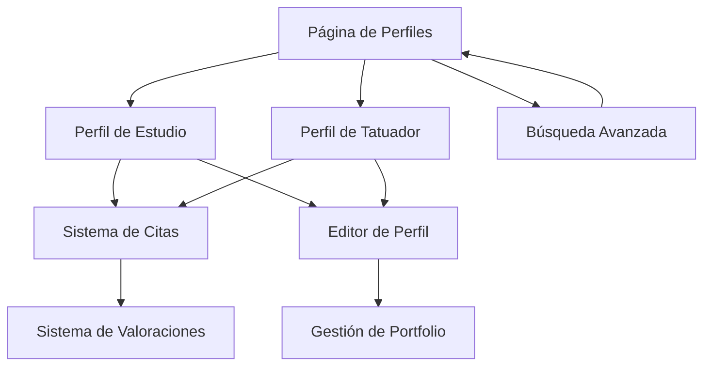

# Sistema de Perfiles Profesionales - InkLink

## 1. Product Overview
Sistema completo de perfiles profesionales para estudios de tatuajes y tatuadores individuales en InkLink, permitiendo la creación, gestión y búsqueda de perfiles con portfolios, información de contacto, sistema de valoraciones y programación de citas.
- Conecta clientes con estudios y tatuadores profesionales mediante perfiles detallados y funcionalidades de búsqueda avanzada.
- Facilita la promoción profesional de artistas del tatuaje y mejora la experiencia de búsqueda para clientes potenciales.

## 2. Core Features

### 2.1 User Roles
| Role | Registration Method | Core Permissions |
|------|---------------------|------------------|
| Cliente | Email/Google/Facebook | Puede buscar perfiles, ver portfolios, dejar reseñas, programar citas |
| Tatuador | Email + verificación profesional | Puede crear/editar perfil individual, gestionar portfolio, responder a citas |
| Estudio | Email + verificación comercial | Puede crear/editar perfil de estudio, gestionar múltiples tatuadores, administrar citas |
| Admin | Invitación del sistema | Gestión completa de usuarios, moderación de contenido, análisis |

### 2.2 Feature Module
Nuestro sistema de perfiles profesionales consta de las siguientes páginas principales:
1. **Página de Perfiles**: listado y búsqueda de estudios y tatuadores con filtros avanzados.
2. **Perfil de Estudio**: información completa del estudio, galería, tatuadores asociados, reseñas.
3. **Perfil de Tatuador**: portfolio personal, especialidades, disponibilidad, información profesional.
4. **Editor de Perfil**: creación y edición de perfiles con subida de imágenes y gestión de información.
5. **Sistema de Citas**: programación, gestión y seguimiento de citas entre clientes y profesionales.
6. **Sistema de Valoraciones**: reseñas, puntuaciones y comentarios de clientes sobre servicios recibidos.

### 2.3 Page Details
| Page Name | Module Name | Feature description |
|-----------|-------------|---------------------|
| Página de Perfiles | Búsqueda y Filtros | Buscar por ubicación, estilo, disponibilidad, precio. Filtros por especialidades, valoraciones, distancia |
| Página de Perfiles | Lista de Resultados | Mostrar cards de perfiles con imagen, nombre, ubicación, valoración, especialidades principales |
| Perfil de Estudio | Información Básica | Mostrar nombre, dirección, horarios, teléfono, email, redes sociales |
| Perfil de Estudio | Galería de Trabajos | Visualizar portfolio con categorías por estilos, zoom de imágenes, navegación |
| Perfil de Estudio | Tatuadores del Estudio | Lista de tatuadores asociados con enlaces a sus perfiles individuales |
| Perfil de Estudio | Reseñas y Valoraciones | Mostrar puntuación promedio, comentarios de clientes, sistema de likes |
| Perfil de Tatuador | Portfolio Personal | Galería de trabajos organizados por estilos, con descripciones y fechas |
| Perfil de Tatuador | Información Profesional | Experiencia, formación, certificaciones, especialidades, biografía |
| Perfil de Tatuador | Disponibilidad | Calendario de disponibilidad, horarios de trabajo, precios orientativos |
| Editor de Perfil | Gestión de Información | Editar datos básicos, subir imágenes, gestionar especialidades y horarios |
| Editor de Perfil | Gestión de Portfolio | Subir/eliminar imágenes, organizar por categorías, añadir descripciones |
| Sistema de Citas | Programación | Seleccionar fecha/hora, tipo de servicio, enviar solicitud con detalles |
| Sistema de Citas | Gestión de Citas | Ver citas pendientes/confirmadas, modificar/cancelar, comunicación con cliente |
| Sistema de Valoraciones | Dejar Reseña | Puntuar servicio (1-5 estrellas), escribir comentario, subir fotos del resultado |
| Sistema de Valoraciones | Gestión de Reseñas | Responder a comentarios, reportar reseñas inapropiadas, estadísticas |

## 3. Core Process

**Flujo de Cliente:**
1. El cliente accede a la página de perfiles y utiliza filtros de búsqueda por ubicación, estilo y disponibilidad
2. Navega por los resultados y selecciona un perfil de interés (estudio o tatuador)
3. Revisa el portfolio, lee reseñas y verifica disponibilidad
4. Programa una cita proporcionando detalles del tatuaje deseado
5. Recibe confirmación y gestiona la cita hasta su realización
6. Después del servicio, deja una valoración y reseña

**Flujo de Tatuador/Estudio:**
1. Se registra y crea su perfil profesional con información básica
2. Sube imágenes a su portfolio organizándolas por estilos y especialidades
3. Configura su disponibilidad, horarios y precios
4. Recibe solicitudes de citas de clientes potenciales
5. Confirma o rechaza citas, gestiona su calendario
6. Responde a reseñas y mantiene actualizado su perfil

## 4. User Interface Design

### 4.1 Design Style
- **Colores primarios:** Negro (#000000) y blanco (#FFFFFF) con acentos en dorado (#FFD700)
- **Colores secundarios:** Grises (#F5F5F5, #E5E5E5, #CCCCCC) para fondos y separadores
- **Estilo de botones:** Redondeados con bordes suaves (border-radius: 8px), efectos hover sutiles
- **Tipografía:** Geist Sans para textos principales, Geist Mono para elementos técnicos, tamaños 14-18px
- **Layout:** Diseño tipo card con espaciado generoso, navegación superior fija, sidebar para filtros
- **Iconos:** Estilo minimalista con líneas finas, preferencia por iconos de Lucide React

### 4.2 Page Design Overview
| Page Name | Module Name | UI Elements |
|-----------|-------------|-------------|
| Página de Perfiles | Búsqueda y Filtros | Barra de búsqueda prominente, filtros en sidebar colapsible, mapa interactivo opcional |
| Página de Perfiles | Lista de Resultados | Grid responsivo de cards (3 columnas desktop, 1 móvil), paginación, ordenamiento |
| Perfil de Estudio | Hero Section | Imagen de portada, logo del estudio, información básica en overlay, botón CTA principal |
| Perfil de Estudio | Galería | Grid masonry para imágenes, lightbox para zoom, filtros por categoría |
| Perfil de Tatuador | Portfolio | Slider de imágenes destacadas, grid organizado por estilos, navegación por pestañas |
| Editor de Perfil | Formularios | Campos organizados en secciones, drag & drop para imágenes, preview en tiempo real |
| Sistema de Citas | Calendario | Vista de calendario interactivo, slots de tiempo disponibles, formulario de solicitud |
| Sistema de Valoraciones | Reseñas | Cards de comentarios con avatar, estrellas, fecha, botones de interacción |

### 4.3 Responsiveness
Diseño mobile-first con breakpoints en 768px (tablet) y 1024px (desktop). Optimización táctil para navegación en dispositivos móviles, con gestos swipe para galerías y menús colapsibles. Imágenes optimizadas con lazy loading y diferentes resoluciones según dispositivo.